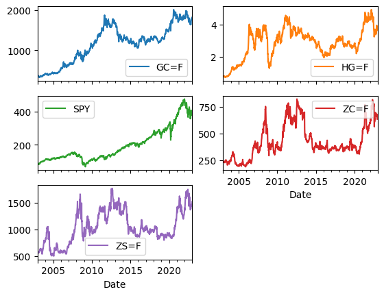
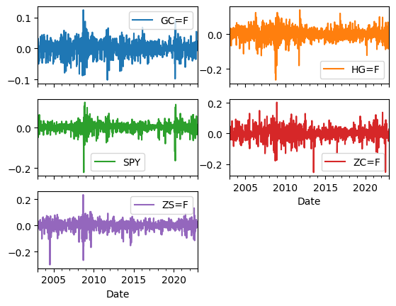
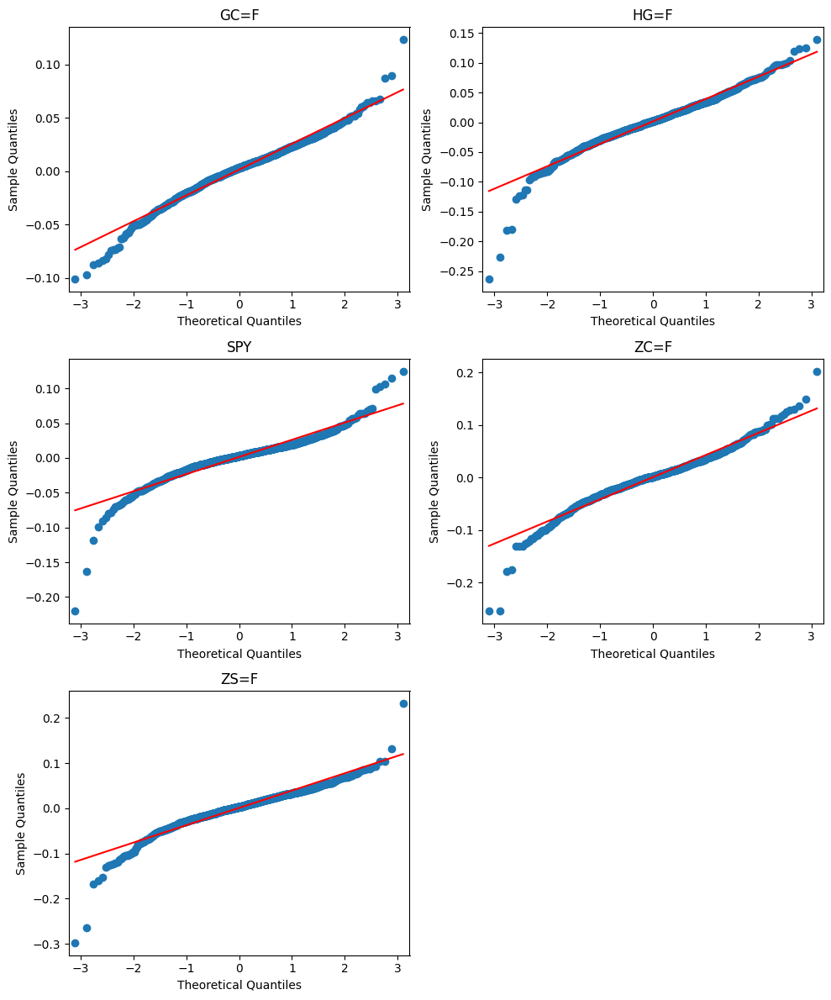
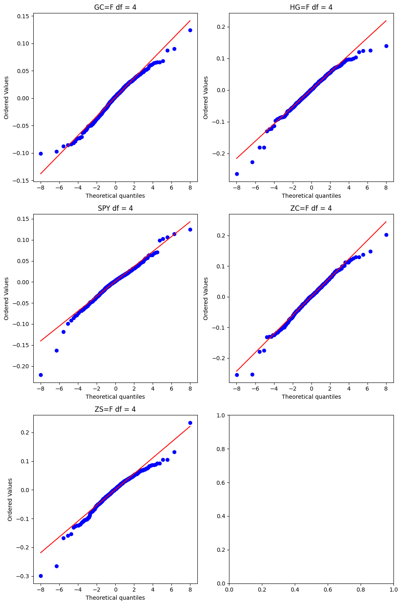
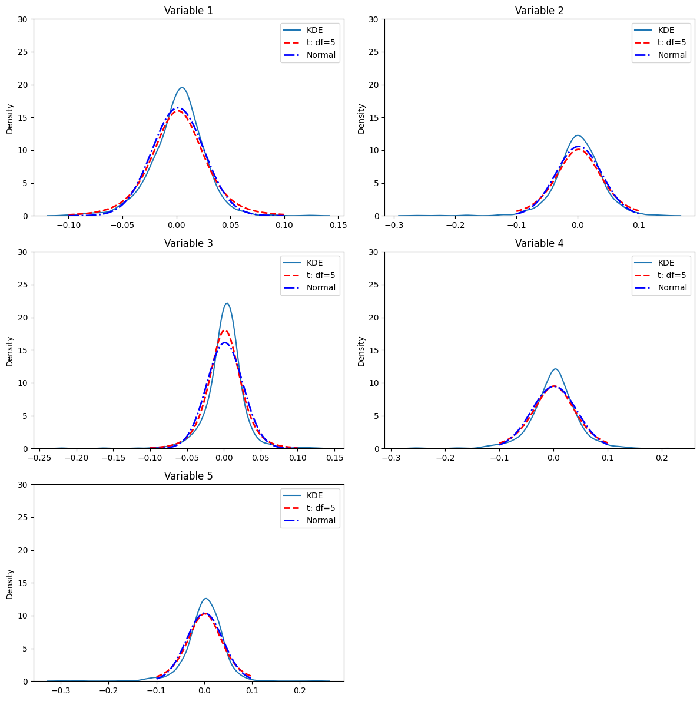

# Commodity Returns Analysis

## Project Overview
This project focuses on analyzing the log returns of various commodities over time. The code is a practical application of the first chapters of *"Statistics and Data Analysis for Financial Engineering: with R examples"* by David Ruppert and David S. Matteson. Through this analysis, the project explores distribution characteristics, normality, and underlying patterns in commodity returns using statistical tests and visualizations.

## Installation and Requirements
The project requires the following Python libraries:
- `pandas` for data handling
- `numpy` for numerical operations
- `pandas_datareader` and `yfinance` for accessing financial data
- `matplotlib` and `seaborn` for data visualization
- `scipy` and `statsmodels` for statistical analysis

Install dependencies using:
```bash
pip install pandas numpy pandas_datareader yfinance matplotlib seaborn scipy statsmodels
```

## Usage
1. **Download Data**  
   The notebook fetches historical commodity data using `pandas_datareader` and `yfinance`. The following function can be used to fetch data for a specific commodity:
   ```python
   import yfinance as yfin
   yfin.pdr_override()
   from pandas_datareader import data as pdr
   
   data = pdr.get_data_yahoo("COMMODITY_SYMBOL", start="YYYY-MM-DD", end="YYYY-MM-DD")
   ```

2. **Calculate Log Returns**  
   Log returns are calculated to analyze relative price changes:
   ```python
   returns = np.log(data['Close'] / data['Close'].shift(1)).dropna()
   ```

3. **Normality and Distribution Analysis**  
   The project includes code for statistical analysis and visualization:
   - **QQ Plot** to visually assess normality.
   - **Shapiro-Wilk Test** for statistical normality testing.
   - **T-Plot** for examining the temporal dynamics of log returns.
   - **Kernel Density Estimation (KDE)** for estimating the probability density function of log returns.
   ```python
   from scipy import stats
   stats.probplot(returns, dist="norm", plot=plt)
   ```
   
4. **Visualize Results**  
   Example commands for visualizing data distributions and trends:
   ```python
   returns.plot(kind='hist', bins=50, title='Log Returns Distribution')
   sns.kdeplot(returns, shade=True)
   ```

## Results Summary
The analysis provides insights into the statistical properties of commodity log returns. Key findings include the distribution of returns, deviations from normality, and volatility patterns over time, as illustrated by QQ plots, T-plots, and KDE visualizations.

### Sample Output


*Figure 1. Price series of selected commodities over time*


*Figure 2. Log returns of selected commodities, showing periods of volatility*


*Figure 3. QQ Plots and Shapiro-Wilk test results for assessing normality in commodity log returns*


*Figure 4. T-Plots illustrating temporal dynamics in commodity log returns*


*Figure 5. Kernel Density Estimates (KDE) for the distribution of commodity log returns*

## Files in this Repository
- `Commodity_Returns.ipynb` - Jupyter notebook with the code for data retrieval, processing, and statistical analysis.
- `images/` - Folder containing example output images.
- `docs/` - Contains a detailed methodology document in PDF format for deeper insights.

## License
This project is licensed under the MIT License (or isn´t?). I guess I just want to thanks the authors for the inspiration, but the code was translated from R to Python, and they applied mostly to the S&P500, so...
